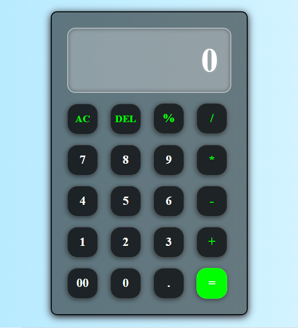

# Simple Calculator

This is a basic web-based calculator application built using HTML, CSS, and JavaScript.

[Calculator Demo](./calculator-demo.mp4)

## Features

- Perform basic arithmetic operations: addition, subtraction, multiplication, and division.
- Clear the input with the AC (All Clear) button.
- Delete the last character with the DEL (Delete) button.
- Calculate percentage with the % button.
- Responsive design that adapts to different screen sizes.
- Error handling for division by zero and other format errors.

## Demo

You can see a live demo of the calculator [here](https://simple-calculator-by-muhammad-ahmad.surge.sh/).

## Screenshots



## Technologies Used

- HTML
- CSS
- JavaScript

## Installation

To run this project locally, follow these steps:

1. Clone the repository:

```bash
   git clone https://github.com/ahmedjawad1857/simple-calculator.git
```

2. Navigate into the project directory:

```bash
   cd simple-calculator
```

3. Open `index.html` in your browser.

## Usage

- Click on the buttons to input numbers and perform operations.
- Use AC to clear the input box completely.
- Use DEL to delete the last character in the input.
- Use = to calculate the result of the arithmetic expression entered.

## Contributing

Contributions are welcome! Here's how you can contribute:

1. Fork the repository.
2. Create your feature branch (`git checkout -b feature/MyFeature`).
3. Commit your changes (`git commit -am 'Add some feature'`).
4. Push to the branch (`git push origin feature/MyFeature`).
5. Open a pull request.

## Contact

Muhammad Ahmad

- **LinkedIn**: https://www.linkedin.com/in/muhammad-ahmad-jawad-a780512bb/
- **Github**: https://github.com/ahmedjawad1857
- **Email Me At**: <a href="mailto:ahmedjawad1857@gmail.com">ahmedjawad1857@gmail.com</a><br>

**project-link**: https://github.com/ahmedjawad1857/simple-calculator
